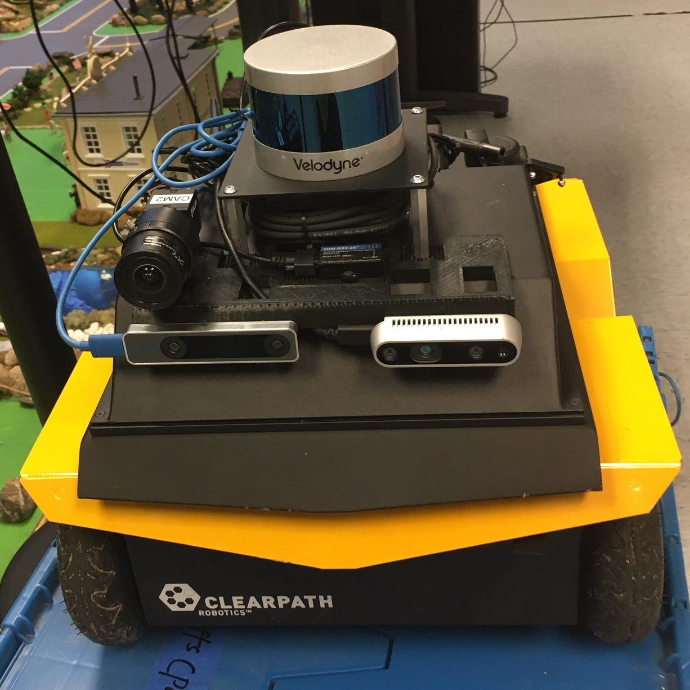

# icalib.github.io
Inertial Aided Multi-Sensor Calibration

## Description

To calibration the spatial-temporal parameters for multiple sensors, including IMU, cameras, LiDAR and wheel encoder. 

## Sensors 

#### Tested Sensors

* IMU: microstrain IMU, xsens IMU, realsense-t265 IMU / Gyro
* Cameras: FLIR Blackfly/pointgrey, t265 stereo-fisheye
* LiDAR: Velodyne VLP-16
* Wheel encoder: Jackal wheel encoder

#### Sensors going to support

* Ouster Lidar
* Accelerometer
* GPS / GNSS

## Requirements

* At least 1 IMU and 1 Camera (as the base IMU and base camera)
* QR tags: Aruco Tag (supported) and April Tag (testing)
* For LiDAR calibration: structural environment with planes
* Motion: 3D motion with at least 2-axis rotation
* 2 - 4 Tag planes (each plane with 6-9 tags)  as shown in the following fig

#### Example setup: 

The Jackal is equipped with: microstrain gx3-25, FLIR pointgrey, Realsense T265. The Jackcal contains wheel encoder.
From each sensor, the meassages needed are:

* Microstrain IMU: /imu_ms/data, sensor_msgs/Imu
* FLIR pointgrey: /camera_pg/image_raw, sensor_msgs/Image
* Realsense T265 Stereo: /camera/fisheye1/image_raw, /camera/fisheye2/image_raw, sensor_msgs/Image
* Realsense T265 gyro: /camera/gyro/sample, sensor_msgs/Imu
* Velodyne: /velodyne_packets, velodyne_msgs/VelodyneScan (important)
* Jackal wheel encoder: /joint_states, sensor_msgs/JoinState

## Supporting materials

* For iCalib [workshop paper](pdf/2021_vinsworkshop_iCalib.pdf).
* For iCalib [workshop slides](pdf/ICRA_2021_workshop_icalib_slides.pdf).
* For iCalib [workshop video](video/icalib_vins_workshop_yulin.mp4). 

## Compilation

### Supporting libs

* OpenVINS, v2.10
* GTSAM, latest version
* Eigen

### Launch file 

